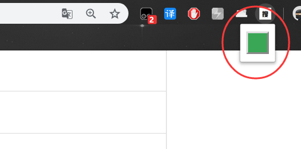
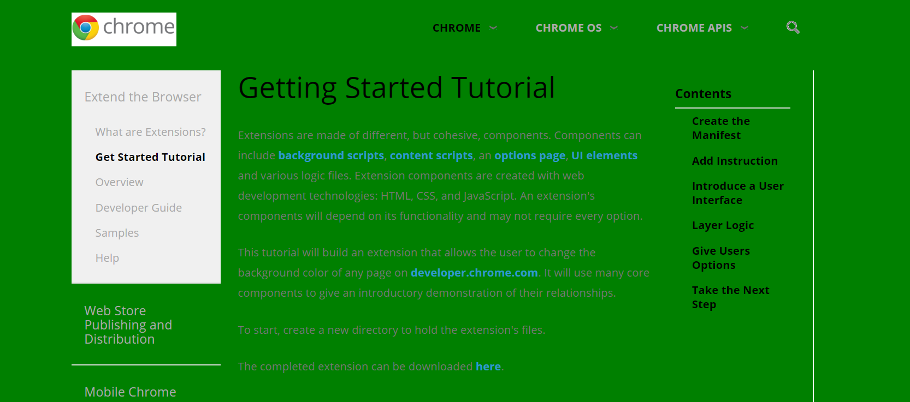

### chrome extensions -- change page color

###### Introduction

This extension is the sample from chrome extension ' s getting started tutorial.

It is just a practice , you can learn how to build a chrome extensions from this code.

Also , you can learn from <a href="https://developer.chrome.com/extensions/getstarted">Official documents </a>

###### Useful

1. download the code from this page.
2. add the extension into your extension program.
3. now you can use it.

###### Tips

It is just a practice , you cannot find it on the chrome application shop , and you also could not use it on other pages . Importantly , it is just a practice , you can learn it from you own environmental . 

###### Effect

